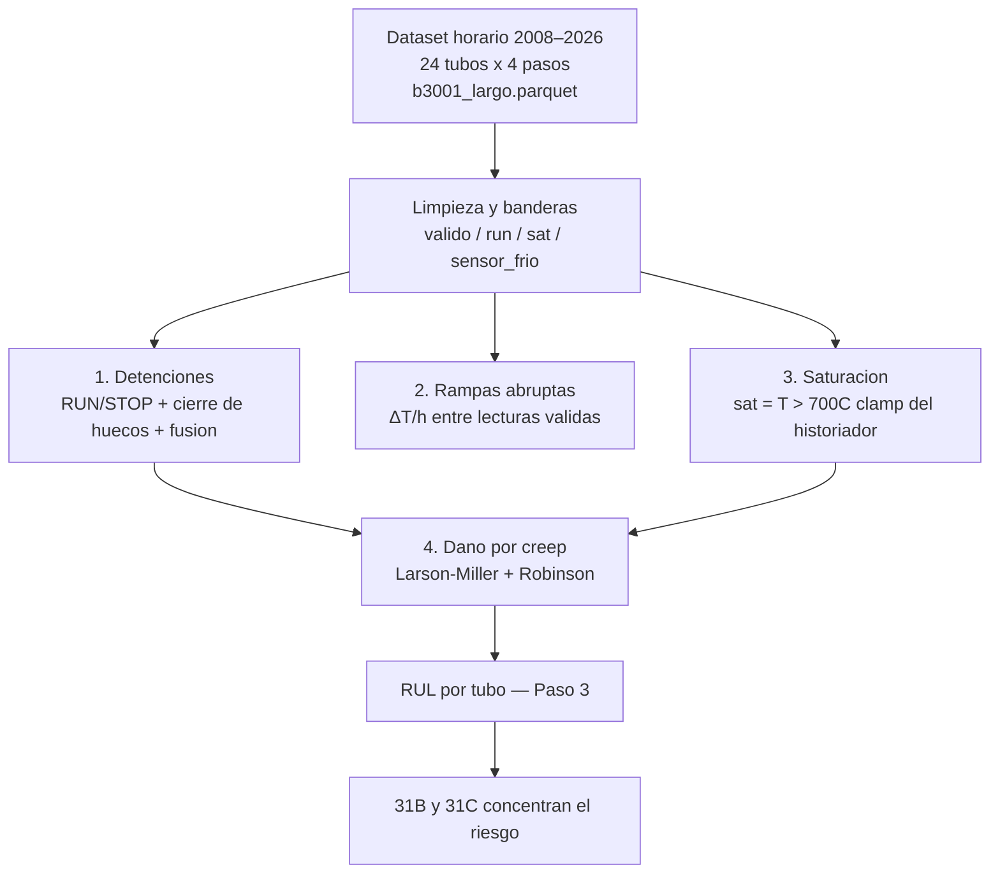
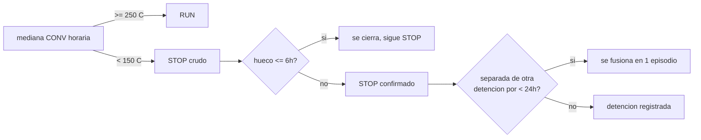
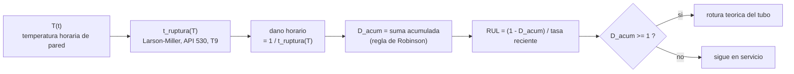
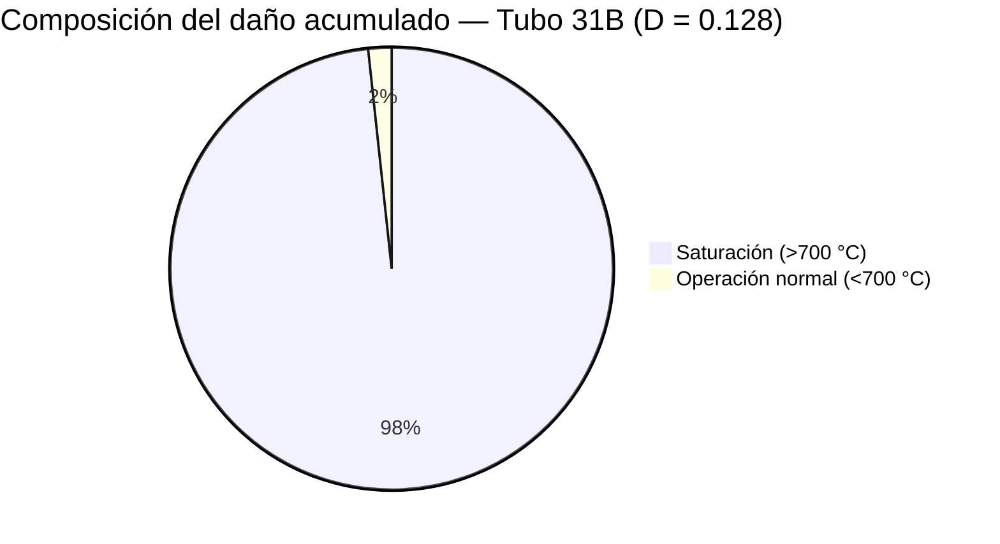
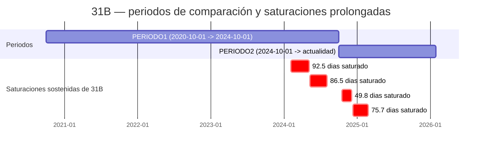

# Horno B-3001 — Detenciones, rampas, saturación y daño por creep

**Pregunta central:** ¿qué tan sano está el horno hoy, y qué tubo hay que vigilar primero?
**Respuesta corta:** el horno opera con normalidad la mayor parte del tiempo, pero **dos tubos del Paso 3 (31B y 31C) concentran casi todo el daño por creep del paso**, y en el 98% de los casos ese daño viene de **saturaciones prolongadas** (temperatura de pared por sobre 700 °C durante semanas o meses), no de la operación normal. El tubo **31B** es el crítico: su vida remanente (RUL) se estima entre **37 y 93 años** según el método, muy por debajo del resto de sus vecinos de paso.

| | |
|---|---|
| Fuente | `features/b3001_largo.parquet` (despivot horario limpio) → `EDA_B3001.ipynb` |
| Datos | 2008-06-05 → 2026-01-30 · horario · 24 tubos · 4 pasos (P1–P4) · 6 tubos/paso |
| Norma / material | API 530, Larson-Miller, acero T9 |
| Ventanas de comparación | **PERIODO1** 2020-10-01 → 2024-10-01 · **PERIODO2** 2024-10-01 → actualidad |

---

## 0. Alcance y metodología

Todo el análisis parte del mismo dataset horario despivotado (`b3001_largo.parquet`), con cuatro banderas de calidad ya calculadas por fila: `valido`, `run` (horno operando), `sat` (sensor saturado, >700 °C) y `sensor_frio`/`sensor_flat` (fallas de instrumento). Sobre esa base se construyen cuatro análisis independientes que convergen en una conclusión de vida remanente (RUL).

**¿Por qué comparar dos periodos?** El histórico completo (18 años) mezcla una operación "tranquila" (2008–2020, saturación casi nula) con una etapa reciente donde el problema de saturación aparece y se sostiene. Comparar **PERIODO1** contra **PERIODO2** responde la pregunta que más importa para una presentación: *¿el problema se está agravando, estabilizando o resolviendo ahora mismo?*

---

## 1. Detenciones del horno

**Método:** estado horario RUN/STOP a partir de la mediana de los sensores `CONV` de los 4 pasos (`RUN_TH = 250 °C`, `STOP_TH = 150 °C`), con cierre de huecos cortos (≤6 h) y fusión de detenciones separadas por menos de 24 h (para no contar dos veces un rearranque fallido).

### Resultados

| Ventana | Detenciones | Días parado | % del tiempo |
|---|---:|---:|---:|
| Histórico completo (2008–2026) | 72 | 764 | 11.9 % |
| **PERIODO1** (2020-10 → 2024-10) | 12 | 169 | 11.4 % |
| **PERIODO2** (2024-10 → actualidad) | 6 | 82 | 17.3 % |

La detención más larga de PERIODO2 fue del **2025-04-01 al 2025-05-24 (52.7 días)**. En cada detención la temperatura cae hacia el ambiente y se recupera con una rampa rápida al reencender — el enlace directo con el análisis 2.

---

## 2. Subidas de temperatura abruptas

**Método:** rampa horaria (`ΔT` entre horas consecutivas) por tubo, calculada solo entre dos lecturas **válidas** consecutivas y con el horno operando — así se descartan los saltos falsos de un sensor congelado o saturado por una sola hora. Umbral de "abrupta": **15 °C/h** (≈ percentil 97 histórico). Para comparar periodos de distinta duración se usa **tasa por 1000 h de operación**, no conteo bruto.

### Resultados

| | PERIODO1 | PERIODO2 | Δ |
|---|---:|---:|---:|
| Tasa global (eventos / 1000 h) | 28.9 | 31.6 | +9 % |
| P1 | 32.2 | 35.3 | +10 % |
| P2 | 25.7 | 33.7 | +31 % |
| P3 | 25.6 | 25.4 | ≈ 0 % |
| P4 | 31.3 | 33.3 | +6 % |

- Rampa horaria en operación (histórico completo): P90 = 6.2 °C/h · P95 = 10.0 °C/h · **P99 = 39.2 °C/h**.
- Un arranque tiene **~7x más probabilidad** de traer una rampa abrupta que una hora cualquiera (2.1 % de los eventos cae dentro de 24 h de un arranque, contra 0.3 % de las horas de operación que están en esa ventana).
- Pero el **98 % de los eventos ocurre en operación estable**, lejos de cualquier arranque: las rampas abruptas no son solo un fenómeno de partida, y P2 es el paso donde más creció la frecuencia.

---

## 3. Tiempo de saturación

**Método:** `sat = 1` marca las horas donde el historiador clampeó la lectura por sobre `SAT_LIMITE = 700 °C` (la temperatura real pudo ser igual o mayor; la medición se pierde). Se compara el total de horas saturadas y los episodios (≥2 h continuas) entre PERIODO1 y PERIODO2.

### Resultados

| | PERIODO1 | PERIODO2 |
|---|---:|---:|
| Horas-tubo saturadas | 61,768 h | 22,053 h |
| Episodios (≥2 h) | 326 | 161 |

**Tubos más afectados** (horas saturadas por periodo):

| Tubo | Paso | PERIODO1 | PERIODO2 |
|---|---|---:|---:|
| 18D | P2 | 13,584 | 4,010 |
| 31B | P3 | 13,062 | 4,053 |
| 18B | P2 | 11,585 | 4,003 |
| 18F | P2 | 9,238 | 4,015 |
| 17C | P1 | 8,247 | 901 |
| 31C | P3 | 5,594 | 1 |
| 32C | P4 | 5 | 4,580 |

**Episodio más largo del histórico:** 18F/18B, **147.5 días seguidos saturados** (2024-02-05 → 2024-07-02). El tubo 31B acumula varios episodios de 2-3 meses en ambos periodos (92.5 y 86.5 días en PERIODO1; 75.7 y 49.8 días en PERIODO2) — **no se está frenando**, a diferencia de 31C, que prácticamente dejó de saturarse después de PERIODO1 (de 5,594 h a 1 h).

---

## 4. Daño por creep (API 530) y su efecto en el RUL

### 4.1 El modelo: Larson-Miller + regla de Robinson

`t_ruptura(T)` responde: *si el tubo se mantuviera para siempre a la temperatura T, ¿cuántas horas tardaría en romperse?* Cada hora de operación consume `1 / t_ruptura(T)` de la vida del tubo; la suma de esas fracciones (Robinson) es el daño acumulado `D`. El tubo falla, en teoría, cuando `D = 1`.

**Por qué la saturación pesa tanto: la sensibilidad es extrema.**

| Temperatura de pared | Vida a rotura si se mantuviera constante |
|---:|---:|
| 600 °C | ~15,050 años |
| 634 °C (operación normal de referencia) | ~1,225 años |
| 650 °C | ~401 años |
| 680 °C | ~55 años |
| **700 °C (umbral de saturación)** | **~15.5 años** |
| 705 °C (TMT de diseño) | 11.4 años (ancla de diseño, 100,000 h) |
| 720 °C | ~4.6 años |
| 750 °C | ~0.8 años |

Una diferencia de 66 °C (634 → 700) cambia la vida esperada por un factor de **~80x**. Esto es lo que explica que unas pocas semanas saturado pesen más que años de operación normal.

### 4.2 Resultados por tubo — Paso 3

| Tubo | D acumulado | % daño por saturación | Tasa anual PERIODO1 | Tasa anual PERIODO2 | RUL (a) T reciente | RUL (b) tasa PERIODO2 |
|---|---:|---:|---:|---:|---:|---:|
| **31B** | **0.128** | **98.3 %** | 0.0241 D/año | 0.0234 D/año | **93 años** | **37 años** |
| 31C | 0.042 | 99.0 % | 0.0103 D/año | 0.00004 D/año | 38,206 años | 21,958 años |
| 31E | 0.009 | 9.6 % | 0.0011 D/año | 0.0020 D/año | 87 años* | 491 años |
| 31D | 0.004 | 3.9 % | 0.0002 D/año | 0.0001 D/año | 1,220 años | 7,287 años |
| 31A | 0.002 | 0.0 % | ~0 D/año | 0.0003 D/año | 309 años | 3,224 años |
| 31F | 0.001 | 13.2 % | 0.00004 D/año | 0.00004 D/año | 1.2 M años | 26,513 años |

*RUL (a) usa la temperatura reciente (P95 de los últimos 180 días en operación); RUL (b) extrapola hacia adelante la tasa de daño anual observada en PERIODO2. Se muestran ambos para triangular: cuando coinciden en orden de magnitud (31B), la conclusión es robusta a la elección de método.*

\* 31E tiene una temperatura reciente relativamente alta (P95 = 673 °C) que castiga el método (a), aunque su daño acumulado todavía es bajo — vale la pena vigilarlo como segundo caso, no como urgencia.

### 4.3 Cronología del tubo crítico (31B)

31B mantiene un ritmo de daño **prácticamente idéntico** entre PERIODO1 (0.0241 D/año) y PERIODO2 (0.0234 D/año): el problema no se está acelerando, pero tampoco se resolvió — sigue consumiendo vida al mismo ritmo alto. 31C, en cambio, tuvo su gran episodio de saturación en PERIODO1 (125.6 días en 2021) y desde entonces prácticamente no volvió a saturarse (5,594 h → 1 h), por eso su tasa cayó ~230x y su RUL es tranquilizador pese a un daño acumulado similar en magnitud al de 31B.

---

## 5. Conclusiones para la presentación

1. **El horno opera con normalidad la mayor parte del tiempo** (72 detenciones en 18 años, 11.9 % del tiempo detenido; en PERIODO2 la disponibilidad es algo menor por la parada larga de abril–mayo 2025).
2. **Las rampas abruptas no son un problema de arranque**: ocurren mayormente en operación estable, y su tasa subió ~9 % entre periodos (más en P2, +31 %).
3. **La saturación (>700 °C) es un fenómeno concentrado**, no generalizado: 5 de 24 tubos explican casi toda la exposición, con episodios de hasta 147 días seguidos.
4. **El daño por creep del Paso 3 está dominado por saturación, no por operación normal**: 98 % del daño de 31B y 31C viene de horas saturadas, que son una fracción menor de sus horas totales.
5. **31B es el tubo a vigilar primero**: RUL estimado entre 37 y 93 años (dos métodos independientes), muy por debajo de sus vecinos de paso (cientos a millones de años), con un ritmo de daño que **no está bajando**.
6. **31C es la prueba de que el problema se puede resolver**: su tasa de daño cayó ~230x tras su único gran episodio de saturación — lo que le pasó a 31B en 2024–2025 aún no le pasó a 31C.

---

## Anexo — supuestos y limitaciones

- **Cota inferior en saturación:** durante las horas con `sat=1` la temperatura real pudo ser mayor a 700 °C (el historiador clampea el valor); el daño y el RUL calculados son, si acaso, **optimistas** en esos tramos.
- **Ventana de daño:** el daño acumulado se calcula sobre todo el histórico disponible (2008–2026), no necesariamente desde la instalación real del tubo — es un indicador relativo y de tendencia, no una certificación de vida remanente absoluta.
- **Daño solo en operación:** se asume que el consumo de vida por creep durante una detención (tubo frío) es despreciable frente al de operación a >600 °C, consistente con la sensibilidad extrema mostrada en la sección 4.1.
- **Parámetros del material:** acero T9, `CLM = 20.946`, `TMT_diseño = 705 °C`, vida de diseño de 100,000 h, esfuerzo de pared `σ_h = 22.24 MPa` (ecuación de Barlow) — parámetros de referencia de API 530 provistos para este equipo.
- **RUL (a) vs (b):** el método (a) fija una temperatura futura (P95 reciente) y es sensible a si esa temperatura persiste; el método (b) extrapola el ritmo de daño reciente y es sensible a si las saturaciones de PERIODO2 se repiten. Ninguno reemplaza una inspección física del tubo.
