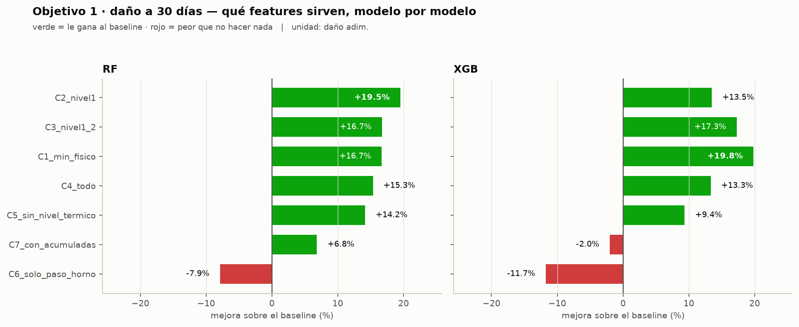
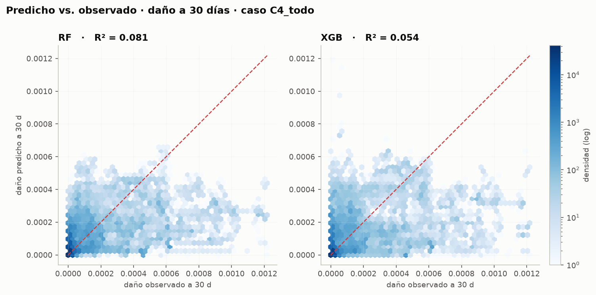
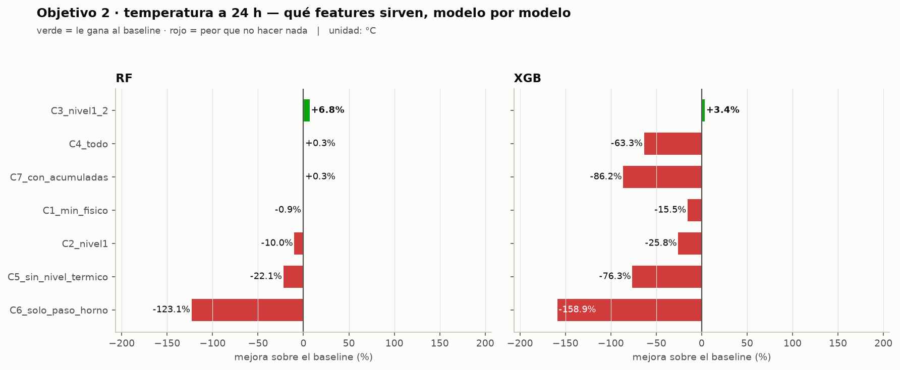
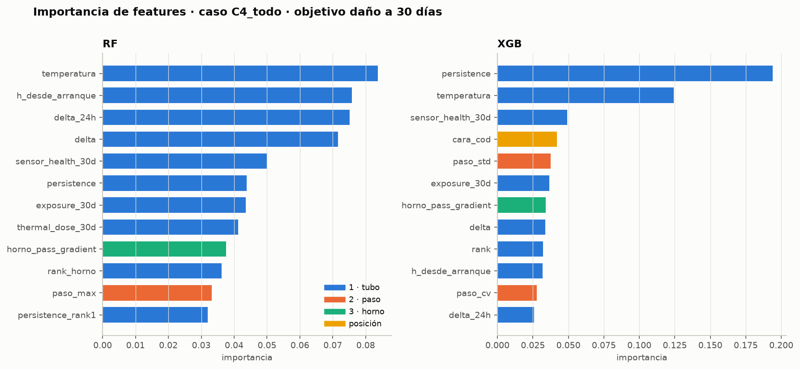
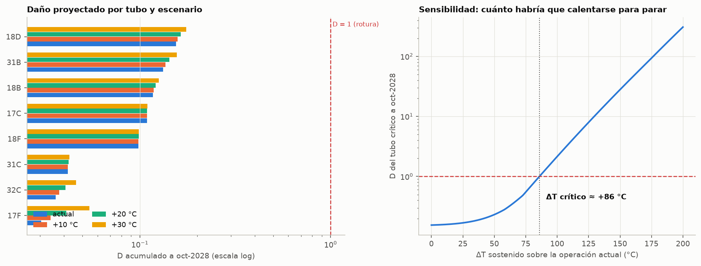

# Horno B-3001 — Modelo baseline y proyección de daño a 2028

**Pregunta:** ¿el B-3001 se detiene o no en octubre de 2028?
**Respuesta corta:** **no**, por fluencia acumulada, con un margen de 6× contra el criterio de rotura.
**El número a vigilar:** **ΔT crítico = +86 °C**.

| | |
|---|---|
| Datos | 1.121.832 filas · 24 tubos × 46.743 horas · oct-2020 → ene-2026 |
| Train | oct-2020 → oct-2024 · 606.004 filas |
| Test | ene-2025 → ene-2026 · 143.880 filas |
| Modelos | Random Forest · XGBoost |
| Fuente | `B3001_features_v2.ipynb` → `B3001_modelo_baseline.ipynb` |

---

## 1. Qué se predice, y qué no

Un modelo de árboles **no extrapola 2,7 años**. Entrenado con features horarias predice a 24 horas o a 30 días, no a 2028. Lo que sí hace es **medir la velocidad a la que el horno consume vida hoy**, y esa velocidad es el insumo de la proyección.

La decisión sobre 2028 se arma entonces en dos pasos separados:

```
   MACHINE LEARNING                      FLUENCIA (aritmética)
   ─────────────────                     ─────────────────────
   features horarias                     D_hoy  = daño acumulado
        │                                  +
        ▼                                Ḋ × horas hasta oct-2028
   tasa de daño actual  ───────────►       │
                                           ▼
                                     ¿D_2028 ≥ 1?  → parada
```

Por eso se entrenan **dos objetivos**, y el importante es el primero.

| Objetivo | Columna | Baseline ingenuo contra el que se mide | Para qué |
|---|---|---|---|
| **1 · Daño a 30 días** | `target_dose_30d` | `thermal_dose_30d` — "el mes que viene será como el anterior" | es la estimación del daño; alimenta la proyección |
| **2 · Temperatura a 24 h** | `target_T_24h` | `lag_24h` — persistencia | mide si las features capturan la dinámica térmica |

> **Cómo leer las tablas:** la columna que importa es **`mejora_%`**, no el MAE. Un MAE bajo no dice nada si el baseline trivial lo consigue igual. Negativo = el modelo es peor que no hacer nada.

---

## 2. Diseño experimental

### 2.1 Corte temporal

```
2020-10 ────────── train (606.004) ────────── 2024-10
                                                 │  embargo 92 días
                                              2025-01 ──── test (143.880) ──── 2026-01
```

El corte es **temporal, nunca aleatorio**: con `lag_24h` en las features, un split aleatorio filtra el futuro y da métricas irreales. El hueco de oct–dic 2024 es un **embargo**: evita que las ventanas móviles de 30 días y los targets a +24 h / +30 d de las últimas filas de train toquen el período de test.

Solo entran filas con `run == 1` (horno en operación) y `valido == 1` (termopar sano). Eso descarta el 29,8 % del panel.

### 2.2 Los siete casos de features

Cada caso responde una pregunta distinta. Compararlos es lo que dice **qué nivel de la jerarquía aporta**.

| Caso | Features | Pregunta que responde |
|---|---|---|
| `C1_min_fisico` | 6 | ¿alcanza con la física básica del tubo? |
| `C2_nivel1` | 16 | ¿cuánto suma el resto del nivel tubo? |
| `C3_nivel1_2` | 26 | ¿el contexto del paso mejora la predicción del tubo? |
| `C4_todo` | 36 | ¿el estado global del horno agrega algo? |
| `C5_sin_nivel_termico` | 31 | ¿hay señal más allá de "está caliente"? |
| `C6_solo_paso_horno` | 18 | ¿se puede predecir un tubo **sin medirlo**? |
| `C7_con_acumuladas` | 38 | *diagnóstico*: qué pasa si se meten variables acumuladas |

---

## 3. Objetivo 1 — Daño a 30 días



### 3.1 Resultados

| Caso | Modelo | Feats | MAE | MAE baseline | mejora_% | R² | seg |
|---|---|---|---|---|---|---|---|
| **C1_min_fisico** | **XGB** | **6** | **7,890e-05** | 9,838e-05 | **+19,8** | 0,059 | 0,6 |
| C2_nivel1 | RF | 16 | 7,941e-05 | 9,865e-05 | +19,5 | 0,053 | 7,1 |
| C3_nivel1_2 | XGB | 26 | 8,167e-05 | 9,872e-05 | +17,3 | 0,074 | 0,9 |
| C3_nivel1_2 | RF | 26 | 8,220e-05 | 9,872e-05 | +16,7 | 0,087 | 10,8 |
| C1_min_fisico | RF | 6 | 8,199e-05 | 9,838e-05 | +16,7 | 0,076 | 4,2 |
| C4_todo | RF | 36 | 8,357e-05 | 9,872e-05 | +15,3 | 0,081 | 12,7 |
| C5_sin_nivel_termico | RF | 31 | 8,473e-05 | 9,872e-05 | +14,2 | 0,075 | 10,0 |
| C2_nivel1 | XGB | 16 | 8,534e-05 | 9,865e-05 | +13,5 | −0,053 | 0,7 |
| C4_todo | XGB | 36 | 8,557e-05 | 9,872e-05 | +13,3 | 0,054 | 1,1 |
| C5_sin_nivel_termico | XGB | 31 | 8,947e-05 | 9,872e-05 | +9,4 | 0,020 | 1,0 |
| C7_con_acumuladas | RF | 38 | 9,197e-05 | 9,872e-05 | +6,8 | 0,011 | 12,5 |
| C7_con_acumuladas | XGB | 38 | 1,007e-04 | 9,872e-05 | **−2,0** | −0,217 | 1,1 |
| C6_solo_paso_horno | RF | 18 | 1,066e-04 | 9,882e-05 | **−7,9** | 0,007 | 9,4 |
| C6_solo_paso_horno | XGB | 18 | 1,104e-04 | 9,882e-05 | **−11,7** | −0,028 | 0,8 |

### 3.2 Las tres conclusiones

**1 · Menos features gana.** Las **6 features mínimas superan a las 36**. XGBoost con `C1_min_fisico` da +19,8 %; el mismo modelo con `C4_todo` cae a +13,3 %. Con R² de 0,06–0,09 la señal disponible es poca, y las 30 features extra son ruido que desestabiliza el ajuste.

**2 · Las acumuladas rompen el modelo — `C7` está para demostrarlo.** Agregar `exposure` y `thermal_dose` degrada RF de +15,3 % a +6,8 %, y hunde a XGBoost por debajo del baseline (−2,0 %, R² = −0,217). El motivo es estructural: esas variables **crecen monótonamente**, así que en el test toman valores que nunca aparecieron en train. Un árbol no extrapola — corta en el último umbral que vio y predice constante de ahí en adelante.

**3 · No se puede predecir un tubo sin medirlo.** `C6_solo_paso_horno` es negativo en ambos modelos (−7,9 % y −11,7 %). El estado del paso y del horno **no reconstruyen** el comportamiento de un tubo individual. Consecuencia operativa directa: los termopares fuera de servicio —como el **18A**, que desde abril-2025 marca menos de 300 °C con el horno encendido— hay que **repararlos, no modelarlos**.

### 3.3 Por qué el R² es bajo



La nube no se apoya en la diagonal: ambos modelos **sub-predicen sistemáticamente** los valores altos de daño. Esto no es un error de implementación, es el límite de la información disponible. El daño de los próximos 30 días depende de decisiones operativas —carga, fuego, duración de campaña— que **no están en el dataset**. Con lo que hay, mejorar ~20 % sobre "el mes que viene será como el anterior" es un resultado honesto y suficiente para estimar la tasa, que es el único uso que se le da acá.

---

## 4. Objetivo 2 — Temperatura a 24 horas



### 4.1 Resultados

| Caso | Modelo | Feats | MAE (°C) | MAE baseline | mejora_% | R² | seg |
|---|---|---|---|---|---|---|---|
| **C3_nivel1_2** | **RF** | **26** | **20,61** | 22,10 | **+6,8** | 0,618 | 9,7 |
| C3_nivel1_2 | XGB | 26 | 21,36 | 22,10 | +3,4 | 0,590 | 2,0 |
| C4_todo | RF | 36 | 22,03 | 22,10 | +0,3 | 0,609 | 11,5 |
| C7_con_acumuladas | RF | 38 | 22,05 | 22,10 | +0,3 | 0,613 | 11,9 |
| C1_min_fisico | RF | 6 | 22,50 | 22,30 | −0,9 | 0,585 | 3,6 |
| C2_nivel1 | RF | 16 | 24,58 | 22,35 | −10,0 | 0,555 | 6,5 |
| C1_min_fisico | XGB | 6 | 25,75 | 22,30 | −15,5 | 0,390 | 1,4 |
| C5_sin_nivel_termico | RF | 31 | 26,99 | 22,10 | −22,1 | 0,570 | 9,1 |
| C2_nivel1 | XGB | 16 | 28,10 | 22,35 | −25,8 | 0,446 | 1,7 |
| C4_todo | XGB | 36 | 36,10 | 22,10 | −63,3 | 0,303 | 2,3 |
| C5_sin_nivel_termico | XGB | 31 | 38,96 | 22,10 | −76,3 | 0,251 | 2,2 |
| C7_con_acumuladas | XGB | 38 | 41,17 | 22,10 | −86,2 | 0,207 | 2,7 |
| C6_solo_paso_horno | RF | 18 | 49,38 | 22,13 | −123,1 | 0,261 | 10,1 |
| C6_solo_paso_horno | XGB | 18 | 57,31 | 22,13 | −158,9 | −0,003 | 1,8 |

Solo un caso le gana claramente a la persistencia: **`C3_nivel1_2` con RF, +6,8 %**. Y ahí está el aporte del nivel 2: sumar el contexto del paso a las features del tubo mejora de −10,0 % (`C2_nivel1`) a **+6,8 %**. Es el salto más grande de toda la tabla.

### 4.2 El techo del objetivo

El MAE no lo fija el régimen normal: lo fijan las maniobras.

| ΔT real en 24 h | % de filas | MAE del baseline | Aporte al MAE total |
|---|---|---|---|
| 0–5 °C | 62,4 % | 8,37 | 5,23 |
| 5–20 °C | 27,0 % | 19,72 | 5,32 |
| 20–100 °C | 7,5 % | 52,06 | 3,90 |
| **> 100 °C** | **3,2 %** | **251,99** | **7,95** |

El **3 % de filas con saltos mayores a 100 °C son arranques y paradas** — cambios de consigna operativa, no deriva térmica. Se llevan **el 36 % del error total**. Ningún modelo alimentado solo con historia térmica los anticipa.

**Conclusión:** para mejorar acá no hacen falta más features térmicas, hace falta **información de proceso que hoy no está en el dataset**: consignas, caudal, composición de carga.

---

## 5. Qué mira cada modelo



Los dos modelos coinciden en el **reparto por nivel** de la jerarquía, y eso valida el diseño de features:

| Nivel | RF | XGB |
|---|---|---|
| 1 · Tubo | 0,641 | 0,625 |
| 2 · Paso | 0,189 | 0,168 |
| 3 · Horno | 0,130 | 0,140 |
| Posición | 0,039 | 0,066 |

Aproximadamente **⅔ tubo, ⅕ paso, ⅛ horno**, casi idéntico entre modelos. Los tres niveles aportan; ninguno es prescindible.

Donde difieren es en **cómo reparten dentro del nivel**:

- **RF distribuye**: su feature más importante llega apenas a 0,084 y las 12 primeras están todas entre 0,03 y 0,08. Al muestrear `sqrt(n)` features por split, reparte el crédito entre variables correlacionadas.
- **XGBoost concentra**: `persistence` sola se lleva **0,195**, más del doble que la segunda. El boosting elige agresivamente el mejor corte y se queda con un representante por bloque de colinealidad.

Que `persistence` domine en XGBoost es coherente con el análisis de correlación de la Parte I, donde también era el predictor más fuerte del riesgo térmico. **Cuánto lleva caliente un tubo importa más que cuán caliente está ahora.**

---

## 6. Proyección a octubre de 2028

### 6.1 Método

Criterio de **Robinson**: el daño acumulado llega a 1 en la rotura por fluencia.

$$D_{2028} = D_{\text{hoy}} + \dot{D} \cdot h_{\text{operación restantes}}$$

La tasa **no se extrapola de una tendencia**. Se recalcula: se toma la distribución real de temperaturas de cada tubo en los últimos 12 meses de operación, se la corre ΔT grados, y se evalúa el daño horario a esa temperatura con Larson-Miller. El daño es **exponencial** en la temperatura, así que una regla de tres daría cualquier cosa.

| Parámetro | Valor |
|---|---|
| Último dato | 2026-01-30 |
| Horizonte | 2,67 años |
| Disponibilidad operativa | 78,8 % |
| Horas de operación hasta la meta | 18.416 h |
| Criterio | D ≥ 1,0 |

### 6.2 Resultado



| Tubo | Paso | D hoy | actual | +10 °C | +20 °C | +30 °C |
|---|---|---|---|---|---|---|
| **18D** | P2 | **0,1515** | **0,1549** | 0,1580 | 0,1640 | 0,1749 |
| 31B | P3 | 0,1281 | 0,1322 | 0,1360 | 0,1431 | 0,1561 |
| 18B | P2 | 0,1158 | 0,1171 | 0,1184 | 0,1209 | 0,1254 |
| 17C | P1 | 0,1088 | 0,1089 | 0,1090 | 0,1092 | 0,1096 |
| 18F | P2 | 0,0982 | 0,0983 | 0,0984 | 0,0986 | 0,0989 |
| 31C | P3 | 0,0418 | 0,0419 | 0,0420 | 0,0423 | 0,0427 |
| 32C | P4 | 0,0346 | 0,0362 | 0,0378 | 0,0407 | 0,0464 |
| 17F | P1 | 0,0267 | 0,0304 | 0,0341 | 0,0411 | 0,0543 |

### 6.3 Veredicto

> ### NO se requiere parada por fluencia en octubre de 2028
> El tubo crítico es el **18D (paso P2)**: D = 0,1515 hoy → **0,1549 proyectado**, contra un límite de 1,0.
> **Margen: 6×.** Ni el escenario de +30 °C sostenidos lo acerca (0,1749).

**El número accionable: ΔT crítico = +86 °C.** Es lo que el 18D tendría que sostener durante los 2,7 años para que el criterio cambie de signo. Da la medida real del margen térmico disponible, y es lo que conviene monitorear mes a mes contra `global_p95`.

---

## 7. Advertencias

**Esto dice que por fluencia acumulada no se llega al límite. No dice que el horno esté sano.**

Los modos de falla que sí podrían forzar una parada antes de 2028 no se ven en `thermal_dose`:

| Modo de falla | Dónde se ve | Estado actual |
|---|---|---|
| Coquización / obstrucción | `paso_spread`, `delta_z_30d` | spread mediano 112 °C, P95 203 °C |
| Quemador desalineado | `paso_cv`, `persistence_rank1` | — |
| Desbalance de distribución | `horno_pass_gradient` | mediana 59 °C, P95 113 °C |
| Falla de instrumentación | `sensor_health_30d` | **18A fuera de servicio desde abr-2025** |

**Supuestos que hereda la proyección:**

1. Anclaje Larson-Miller a 705 °C / 100.000 h (API 530), material T9.
2. Tensión de aro con **espesor nominal** — sin descuento por corrosión ni adelgazamiento medido. Con espesor real de la próxima inspección, `SIGMA_H` cambia y toda la proyección se recalcula sola.
3. La operación futura se parece a la de los últimos 12 meses (78,8 % de disponibilidad).
4. Los tubos con sensor degradado acumulan daño cero en las horas sin lectura válida, así que su D real es **una cota inferior**.

---

## 8. Recomendaciones

1. **Reparar el termopar 18A.** `C6` demuestra que no se puede sustituir por modelo, y el 18D —el tubo crítico— está en el mismo paso P2.
2. **Usar `C1_min_fisico` o `C3_nivel1_2`** según el objetivo. Más features no mejoran; sí encarecen y desestabilizan.
3. **Nunca meter variables acumuladas** en modelos de árboles con corte temporal. Usar `thermal_dose` como nivel inicial y `thermal_dose_30d` como ritmo.
4. **Monitorear el ΔT crítico** mes a mes: `horno_global_p95` contra el margen de +86 °C.
5. **Para mejorar la predicción a 24 h**, incorporar variables de proceso (consignas, caudal, carga). Las térmicas ya dieron lo que tenían.

---

### Reproducción

```
B3001_features_v2.ipynb      →  features/b3001_panel.parquet     (~25 s)
B3001_modelo_baseline.ipynb  →  reportes/*.csv + *.png           (~2 min)
```

**Artefactos:** `resultados_modelos.csv` · `proyeccion_2028.csv` · `importancia_por_nivel.csv` · 5 figuras.

**Parámetros editables** — `B3001_modelo_baseline.ipynb`: corte train/test (celda 3), casos de features (celda 4), modelos (celda 3), criterio `D_LIMITE` y `FECHA_META` (celda 7).
